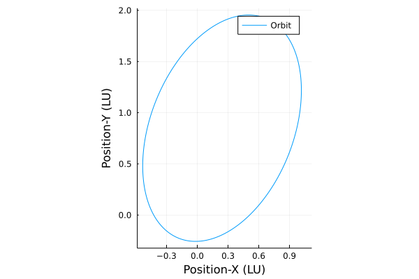
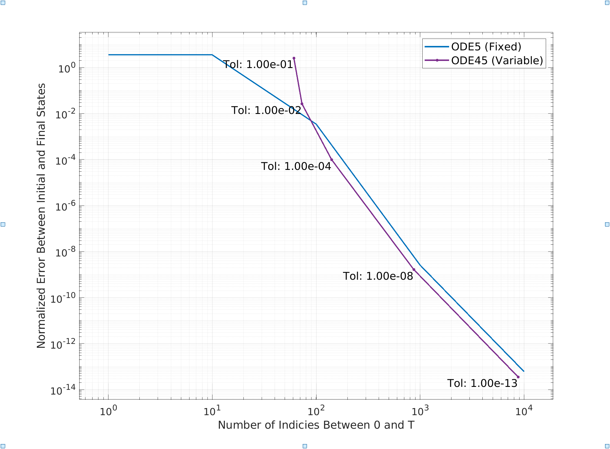

---
title: "ASE387P Optimal Spacecraft Trajectories"
author: [Burton Yale]
date: "2021-09-17"
subject: "ASE387P Optimal Spacecraft Trajectories"
keywords: [ASE387P, UT Austin, Trajectories, Julia]
subtitle: "Homework 1"
lang: "en"
titlepage: true
toc-own-page: true
colorlinks: true
header-includes:
- |
  ```{=latex}
  \usepackage{tcolorbox}

  \newtcolorbox{info-box}{colback=cyan!5!white,arc=0pt,outer arc=0pt,colframe=cyan!60!black}
  \newtcolorbox{warning-box}{colback=orange!5!white,arc=0pt,outer arc=0pt,colframe=orange!80!black}
  \newtcolorbox{error-box}{colback=red!5!white,arc=0pt,outer arc=0pt,colframe=red!75!black}
  ```
pandoc-latex-environment:
  tcolorbox: [box]
  info-box: [info]
  warning-box: [warning]
  error-box: [error]
...

## Problem 1: Computing 
::: box
**Problem Statement** Using the following equation complete parts 1-5:

$$ 
P = \cos\left( z^2 - x{_1} x{_2} x{_3} \right)
$$
:::

### Part 1.1
::: box
**Problem Statement** Using a symbolic manipulator, automate the computation of the first derivative of $P$ with respect to $\textbf{x}$, $\frac{\partial{P}}{\partial{\textbf{x}}}$ or $P_{\textbf{x}}$. Assuming $z = 4$. Show the resulting $P_{\textbf{x}}$ for $\textbf{x} = [1, 2, 3]^T$.
:::

Take the partial derivative of $P$ with respect to each index of $\vec x$ results in the following vector $P_{\textbf{x}}$:

$$ 
P_\textbf{x} = \begin{bmatrix}
	x_2x_3\sin\left( z^2 - x{_1} x{_2} x{_3} \right) \\
	x_1x_3\sin\left( z^2 - x{_1} x{_2} x{_3} \right) \\
	x_1x_2\sin\left( z^2 - x{_1} x{_2} x{_3} \right) 
\end{bmatrix} 
$$

Plugging in the values for $\textbf{x} = [1, 2, 3]^T$, results in the following vector: $P_{\textbf{x}} = [-3.26413, -1.63206, -1.08804]^T$

### Part 1.2
::: box
**Problem Statement** Use complex step differentiation to achieve the same gradient as in [Part 1](#part-1.1). Show the result and absolute error with respect to previous results.
:::

$$
f^\prime = \frac{ \text{imag}\left( f\left( x_0 + hi \right) \right) }{ h }
$$

Using the above equation to calculate the partial derivative, $P_\textbf{x}$, a step of $h$ in the imaginary direction is taken for each $x_i$ and then evaluated above. Using an $h = 10^{-20}$, resulted in the follow vector $P_\textbf{x} = [-3.26413, -1.63206, -1.08804]^T$ and an absolute error of $0$ (I believe this is due to how Julia shortens values). Not until an $h = 10^{-11}$ does the error term become on the order of $10^{-16}$.

### Part 1.3
::: box
**Problem Statement** Use a 3, 5, and 7 point central difference stencil to approximate the same gradient using finite differentiating, at a step size of $h = 10^{-4}$. Show formulas used, the approximated gradients, and their absolute errors with respect to [Part 1](#part-1.1).
:::
$$
f^\prime_\text{3pt} = \frac{-f(x_0 - h) + f(x_0 + h)}{2h}
$$
$$
f^\prime_\text{5pt} = \frac{f(x_0 - 2h) - 8f(x_0 - h) + f(x_0 + h) - f(x_0 + 2h)}{12h}
$$
$$
f^\prime_\text{7pt} = \frac{-f(x_0 - 3h) + 9f(x_0 - 2h) - 45f(x_0 - h) + 45f(x_0 + h) - 9f(x_0 + 2h) + f(x_0 + 3h)}{60h}
$$

Using the above equations for each of the stencils, the following gradients and errors were calculated. 
$$
f^\prime_\text{3pt} = \left[ -3.2641264694904, -1.6320633081884, -1.0880422145226 \right]^T;\quad \varepsilon_\text{3pt} = 1.9750\times10^{-7}
$$
$$
f^\prime_\text{5pt} = \left[ -3.2641266653377, -1.6320633326697, -1.0880422217761 \right]^T;\quad \varepsilon_\text{5pt} = 3.3971\times10^{-12}
$$
$$
f^\prime_\text{7pt} = \left[ -3.264126665337, -1.6320633326698, -1.0880422217775 \right]^T;\quad \varepsilon_\text{7pt} = 2.6353\times10^{-12}
$$

### Part 1.4
::: box
**Problem Statement** Use a symbolic manipulator to automate the computation of the second derivative of $P$ with respect to $\textbf{x}$, assuming z = 4. Show the resulting $P_{{x_1x_1}}$ or $\frac{\partial^2 P}{\partial \textbf{x}^2}(1, 1)$, evaluated at $\textbf{x} = [1, 2, 3]^T$
:::

Symbolically taking the partial derivative of $P_{x_1}$ results in the following equation for $P_{x_1x_1}$:

$$P_{x_1x_1} = -x{_2}^2 x{_3}^2\cos\left( z^2 - x{_1} x{_2} x{_3} \right)$$

Evaluating the equation for $\textbf{x} = [1, 2, 3]^T$ yields this analytical derivative value $P_{x_1x_1} = 30.206575046752288$.

### Part 1.5
::: box
**Problem Statement** Use the complex step method to differentiate the results of [Part 1](#part-1.1) in order to approximate the Hessian results in [Part 4](#part-1.4). Show the result and the absolute error with respect to [Part 4](#part-1.4).
:::

By substituting $P_{x_1}$ into the complex derivative formula for $f$ gives us a numerical solution: $P_{x_1x_1} = 30.206575046752285$ with an error of $3.552713678800501e-15$ for an $h = 10^{-20}$.

## Problem 2
::: box
**Problem Statement** Consider the following initial conditions for a two-body orbit. $\mu$ is the standard gravitational parameter. Units are generic length and time units (LU and TU).
$$
\mu = 1\ \frac{LU^3}{TU^2};\quad \textbf{r}_0 = \begin{bmatrix}
1\\
1\\
0.1
\end{bmatrix}\ LU;\quad \textbf{v}_0 = \begin{bmatrix}
0.1\\
0.7\\
0.3
\end{bmatrix}\ \frac{LU}{TU};\quad \textbf{x}_0 = \begin{bmatrix}
\textbf{r}_0\\
\textbf{v}_0
\end{bmatrix}
$$
:::

### Part 2.1
::: box
**Problem Statement** What is the period of the orbit in TU.
:::
$$
a = \frac{\mu \,\Vert\vec{r}\Vert}{2\,\mu -\Vert\vec{r}\Vert\,\Vert\vec{v}\Vert^2 }
$$
$$
T = 2\pi\sqrt{\frac{a^3}{\mu}}
$$
Using the above equations, the period of the above orbit was found to be $T = 8.4510(...)\text{ TU}$

### Part 2.2

::: box
**Problem Statement** Use a variable step ODE solver with tight tolerances to compute and plot 1 period of the orbit in the $xy$-plane. Verify periodicity by reporting the norm of the vector difference between the beginning and end states. Change ODE tolerances to reduce this error to under $10^{-13}$. Report the order/type of the integrator used and the tolerances needed.
:::

State propagated using Tsit5 variable time solver (from Julia DifferentialEquations package), in order to achieve required error, absolute and relative tolerances of $10^{-13}$ were used. 



### Part 2.3
::: box
**Problem Statement** Using the final tolerance from above, compute the first order state transition matrix for the computed 1 period orbit using:

1) Complex Step Method
2) Variational Method
3) Finite Difference with 3 Point Stencil
4) Finite Difference with 5 Point Stencil
:::

### Part 2.4
::: box
**Problem Statement** Report the full 6x6 matrix for [Part 2.3.1](#part-2.3).
:::
$$
\left[\phi_a(T, t_0)\right] \approx \begin{bmatrix}
1 & 0 & 0 & 0 & 0 & 0 \\
0 & 1 & 0 & 0 & 0 & 0 \\
0 & 0 & 1 & 0 & 0 & 0 \\
0 & 0 & 0 & 1 & 0 & 0 \\
0 & 0 & 0 & 0 & 1 & 0 \\
0 & 0 & 0 & 0 & 0 & 1 \\
\end{bmatrix}
$$

### Part 2.5
::: box
**Problem Statement** Report the Frobenius norm of the matrix in [Part 2.4](#part-2.4).
:::
$$
\Vert\left[\phi_a(T, t_0)\right]\Vert = 2.4494897(...)
$$

### Part 2.6
::: box
**Problem Statement** Compute the Frobenius norm of the matrix difference of the [Parts 2.3.2-2.3.4](#part-2.3) with respect to [Part 2.3.1](#part-2.3).
:::
$$
\Delta\left[\phi_b(T, t_0)\right] = 25.872959(...)
$$
**Note on this number:** I understand this is obviously wrong, they all should be (relatively) equal. I've tried this method in both MATLAB, Julia, and confirmed my equations with papers, so I am not exactly sure what I did wrong. Most likely a simple programmatic error rather than something with my math. I'll explain it in the [Appendix](#variational-equations-stm-method).
$$
\Delta\left[\phi_c(T, t_0)\right] =  0.002676(...)
$$
$$
\Delta\left[\phi_d(T, t_0)\right] =  0.003485(...)
$$

### Part 2.7
::: box
**Problem Statement** Experiment with fixed vs variable step integrators, at different tolerances. Report on the accuracy of the STMs by repeating [Part 2.6](#part-2.6), treating the complex STM as truth. Discuss the results.
:::

Comparing the total number of steps taken, regardless of size, any solution of reasonable accuracy, error under $10^{-4}$, shows that the variable step solves take less total steps to solve the solution than their fixed time step counterparts. From my understanding of how these solvers work, the variable step solvers take larger steps when their are more sure of future gradients estimates. Thus "stepping over" steps required to be taken by the fixed time step solvers.



### Part 2.8
::: box
**Problem Statement** Compute the full Hessian, $\frac{\partial^2 KE}{\partial \textbf{x}_0^2}$, of the kinetic energy KE at $t = t_0 + 5\ TU$ with respect to the initial state using:

1) Variational Method plus Chain Rule
2) Finite Difference of Your Choice (Show Formula)
:::

$$
f^{\prime\prime}_\text{5pt} = \frac{-f(x_0 - 2h) + 16f(x_0 - h) -30f(x_0) + 16f(x_0 + h) - f(x_0 + 2h)}{12h^2}
$$

### Part 2.9
::: box
**Problem Statement** Report the full $6\times6$ matrix for [Part 2.8.1](#part-2.8).
:::

$$
\frac{\partial^2KE}{\partial\textbf{x}} = \begin{bmatrix}
 30.8753 &  39.755  &  10.5566  &  17.4601  &   86.5413 &  25.1257 \\
 39.755  &  45.9582 &  15.0279  &  24.6     &   97.8826 &  32.1899 \\
 10.5566 &  15.0279 &  -2.0744  &   2.36418 &   49.7998 &   5.08131 \\
 17.4601 &  24.6    &   2.36418 &   3.07213 &   68.5336 &  14.036 \\
 86.5413 &  97.8826 &  49.7998  &  68.5336  &  170.047  &  80.2224 \\
 25.1257 &  32.1899 &   5.08131 &  14.036   &   80.2224 &  14.8214 \\
\end{bmatrix}
$$

Due to the issues in [Part 2.6](#part-2.6), the values shown will be from the Finite Difference Method.

### Part 2.10
::: box
**Problem Statement** Report the Frobenius norm of the matrix from [Part 2.9](#part-2.9).
:::

$$
\Vert\frac{\partial^2KE}{\partial\textbf{x}}\Vert = 320.97984(...)
$$

Due to the issues in [Part 2.6](#part-2.6), the values shown will be from the Finite Difference Method.

\newpage

## Appendix

### Variational Equations STM Method
Following both the method in Bates, and your lecture notes I was able to match the equations for the A matrix. (Brackets around variables indicate matrices)
$$
\left[\text{A}\right] = \begin{bmatrix}
\left[0\right] & \left[\textbf{I}\right] \\ 
\left[\text{G}\right] & \left[0\right] \\ 
\end{bmatrix}_{6x6}
$$
$$
\left[\text{G}\right] = \frac{\mu}{\Vert\vec{r}\Vert^5}\left( 3\,\vec{r}\,\vec{r}^T - \Vert\vec{r}\Vert^2\left[\textbf{I}\right] \right)
$$
$$
\left[\dot{\phi}\right] = \left[\text{A}\right]\left[\phi\right]\qquad \left[\phi\right]_0 = \left[\textbf{I}\right]_{6x6}
$$

#### MATLAB Code Tested
.
```matlab
opts = odeset('reltol', 1e-13, 'abstol', 1e-13);
[t, Y] = ode45(f, [0 T], [x; reshape(eye(6), [], 1)], opts);

function du = EoM(u, t, mu)
    rvec = u(1:3);
    r = norm(rvec);
    rhat = rvec/r;
    vvec = u(4:6);
    phi = reshape(u(7:42), 6, 6);

    du(1:3) = vvec;
    du(4:6) = -mu*(rvec/r^3);

    G = mu/r^5 * ( (3 * (rvec*rvec.')) - (r^2*eye(3)) );

    zmtrx = zeros(3, 3);

    A = [zmtrx eye(3); G zmtrx];
    du(7:42) = reshape(A*phi, [], 1);
    du = du(:);
end
```

#### Output
$$
\phi_b = \begin{bmatrix}
   -0.0841 &   -1.0841 &   -0.1084 &   -0.3089 &   -2.1625 &  -0.9268 \\
   -7.5885 &   -6.5885 &   -0.7588 &   -2.1625 &  -15.1373 &  -6.4874 \\
   -3.2522 &   -3.2522 &    0.6748 &   -0.9268 &   -6.4874 &  -2.7803 \\
    3.8042 &    3.8042 &    0.3804 &    2.0841 &    7.5885 &   3.2522 \\
    3.8042 &    3.8042 &    0.3804 &    1.0841 &    8.5885 &   3.2522 \\
    0.3804 &    0.3804 &    0.0380 &    0.1084 &    0.7588 &   1.3252 \\
\end{bmatrix}
$$

I'm not sure why this isn't symmetric, I've done variational equations for the three body problem following this exact method, and did not encounter this problem. Although on a side note, the eigenvalues of this matrix (in diagonal form from `eig`) did return an 6x6 identity matrix. So I believe it is mostly correct, I am just missing one final piece. 

### Julia Notebook Code
(Next Page)