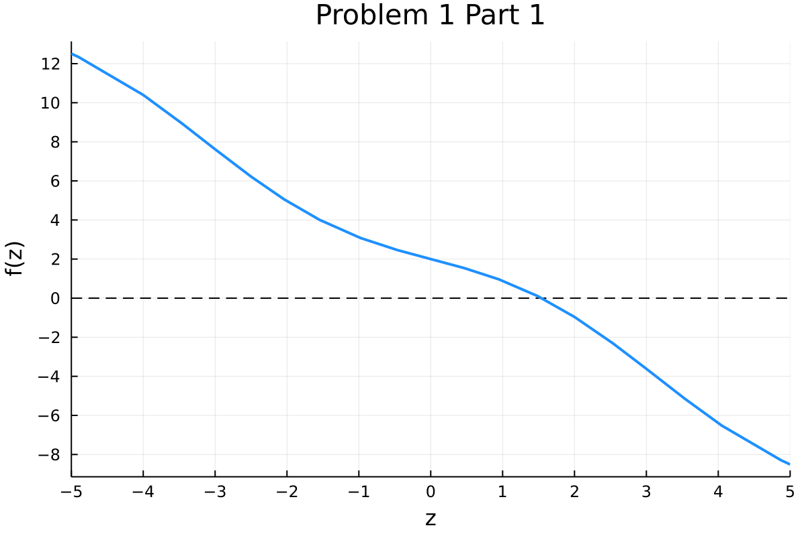
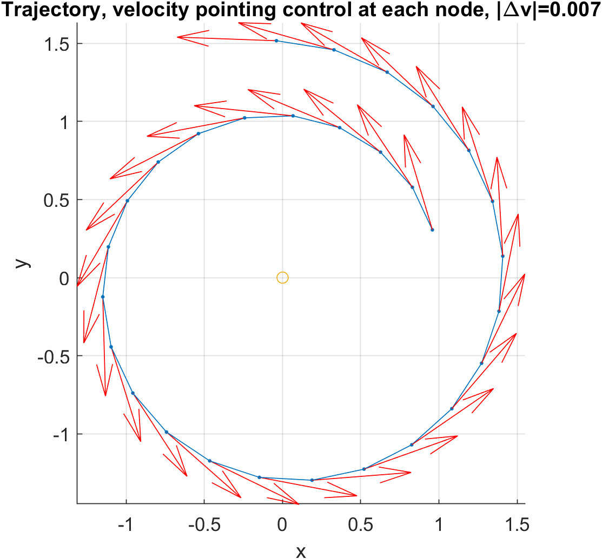
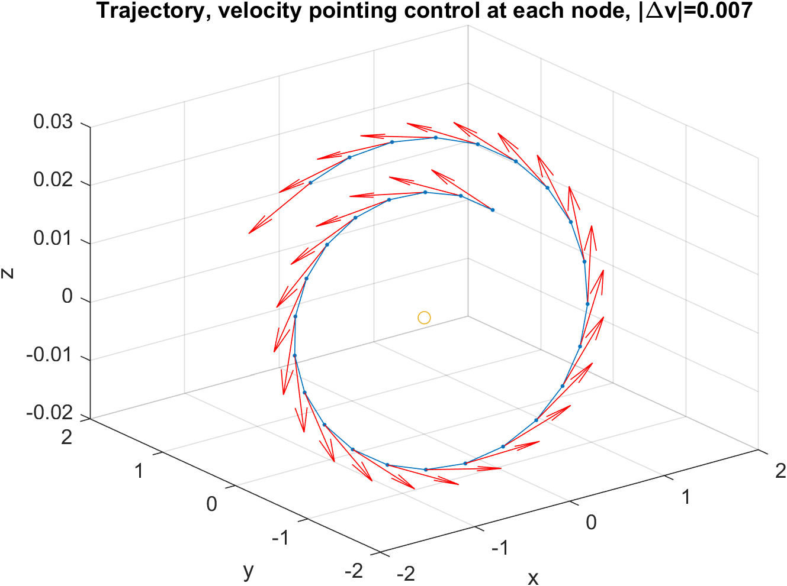
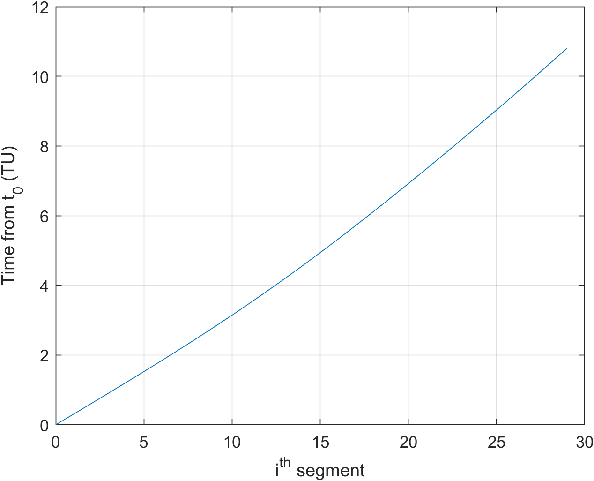

---
title: "ASE387P Optimal Spacecraft Trajectories"
author: [Burton Yale]
date: "2021-10-04"
subject: "ASE387P Optimal Spacecraft Trajectories"
keywords: [ASE387P, UT Austin, Trajectories, Julia]
subtitle: "Homework 2"
lang: "en"
titlepage: false
header-left: "ASE387P"
header-center: "Burton Yale"
header-right: "2021-10-04"
footer-left: "Homework 2"
toc-own-page: true
colorlinks: true
header-includes:
- |
  ```{=latex}
  \usepackage{tcolorbox}

  \newtcolorbox{info-box}{colback=cyan!5!white,arc=0pt,outer arc=0pt,colframe=cyan!60!black}
  \newtcolorbox{warning-box}{colback=orange!5!white,arc=0pt,outer arc=0pt,colframe=orange!80!black}
  \newtcolorbox{error-box}{colback=red!5!white,arc=0pt,outer arc=0pt,colframe=red!75!black}
  ```
pandoc-latex-environment:
  tcolorbox: [box]
  info-box: [info]
  warning-box: [warning]
  error-box: [error]
...

## Problem 1: Root Solving 
::: box
**Problem Statement** Use the following equation, evaluated at $\textbf{x} = \left[ 1,\, 2,\, 3 \right]^T$, to complete parts 1-4:

$$ 
F(\textbf{x}, z) = 2z\sin\left( x_1x_3 + x_2 \right) + \sin\left( z \right)\cos\left( x_1 + x_2 + x_3 \right) + 2
$$
:::

### Part 1.1
::: box
**Problem Statement** Plot the function, $F$, for $z$ values from -5 to 5. 
:::



### Part 1.2
::: box
**Problem Statement** Root solve the equation for $z$, using any method starting with a guess of $z=0$. What is the root to 16 digits?
:::

Using the Julia root solving package, `Roots.jl`, $F(z) = 0$ at the value of $\fbox{z = 1.543295599106779}$.

### Part 1.3
::: box
**Problem Statement** Take one correction step using a guess of $z_0 = 1.5$. Report the error of hte estimated root compared to the actual root when using:

1) First order recursive correction
2) Second order recursive correction
3) Third order recursive correction
4) Quadradic equation correction
5) Halley correction
6) Laguerre correction with an $n=1$
7) Laguerre correction with an $n=2$
8) Laguerre correction with an $n=3$
:::

Error from value obtained in [Part 1.2](#part-1.2) after one step:

| Method | Error |
| --- | --- |
| First Order Recursive Error | $4.8566623763979244e-4$ |
| Second Order Recursive Error | $1.0526718867920337e-5$ |
| Third Order Recursive Error | $2.069224032119621e-7$ |
| Quadratic Error | $4.1154893160033623e-7$ |
| Halley Error | $4.966159171448936e-6$ |
| Laguerre Error $n=1$ | $4.8566623763979244e-4$ |
| Laguerre Error $n=2$ | $4.1154893160033623e-7$ |
| Laguerre Error $n=3$ | $9.107433529553788e-7$ |

### Part 1.4
::: box
**Problem Statement** Complete the root solve until convergence, to 16 digits, for each of the cases in [Part 1.3](#part-1.3), for two cases, $z_0 = 1.5$ and $z_0=0$. In tabular form, report the error at each iteration and discuss the results. State how you define convergence.
:::

When solving for the roots of the function, the stop condition/convergence of the problem was defined as when the next step in the iteration goes below machine precision (indicated by the first zero for each column).

#### Error per iteration per algorithm for $z_0=1.5$

| Iter |halley|quad                         |lag1  |lag2                                         |lag3                 |rec1                  |rec2                  |rec3                |
|---|------|-----------------------------|------|---------------------------------------------|---------------------|----------------------|----------------------|--------------------|
|1|-4.9661e-6|4.1154e-7        |0.0004|4.1154e-7                        |-9.1074e-7|0.0004|-1.05267e-5|2.0692e-7|
|2|0.0   |0.0                          |5.9831e-8|0.0                                          |0.0                  |5.9831e-8  |-2.2203e-16|0.0                 |
|3|0.0|0           |8.8817e-16|0.0                           |0.0   |8.8817e-16 |0.0                   |0.0  |


#### Error per iteration per algorithm for $z_0=0.0$

|Iter|halley|quad                         |lag1  |lag2                                         |lag3                 |rec1                  |rec2                  |rec3                |
|---|------|-----------------------------|------|---------------------------------------------|---------------------|----------------------|----------------------|--------------------|
|1|0.5450|0.5450           |0.5450|0.5450                           |0.5450   |0.5450    |0.5450    |-0.9768 |
|2|0.0101|0.0049         |0.0558|0.0049                        |0.0064 |0.0558   |0.01407   |-0.1033|
|3|6.5701e-8|-2.4337e-10      |0.0007|-2.4343e-10                       |3.8439e-9|0.0007 |3.4951e-7  |6.8823e-6|
|4|0.0   |2.2204e-16        |1.4989e-7|0.0                                          |0.0                  |1.4989e-7  |0.0                   |0.0                 |
|5|0     |0.0                          |5.9952e-15|0                                            |0                    |5.9952e-15 |0                     |0                   |

All methods were able to reach the root to within machine precision. Solvers that used lower order derivatives, on average, took longer to solve for each initial position. Additionally, for the $z_0=0$ case, the error between the actual root and the position after the first step was the same for all terms, except for the third order recursive solver. I attribute this to the fact that the third order recursive solver is the only one to use a third derivative.

\newpage

## Problem 2: Derivatives of a Root Solve Process

::: box
**Problem Statement** Use the following equation, evaluated at $\textbf{x} = \left[ 1,\, 2,\, 3 \right]^T$, to complete parts 1-4:

$$ 
P(\textbf{x}, z) = \cos\left( -x_1x_2x_3 + z^2 \right)
$$
:::

### Part 2.1
::: box
**Problem Statement** Using the complex step method, compute the total derivative of $P$ with respect to $\textbf{x}$.
:::

Evaluating the root solver as a black box, the following derivatives are evaluated by the complex step at the $z_0$ values from [Part 1](#part-1.4).

$$
\frac{dP}{d\textbf{x}}\bigg\rvert_{z_0=z^\star} = \begin{bmatrix} 0.5771 \\ 0.5118 \\ 0.0530 \end{bmatrix}
$$

### Part 2.2
::: box
**Problem Statement** Using the analytical method method, compare the total derivative of $P$ with respect to $\textbf{x}$.
:::

Using the following equation for the total derivative of $P$ with respect to the vector $\textbf{x}$, $\frac{dP}{d\textbf{x}} = \frac{\partial P}{\partial \textbf{x}} + \frac{\partial P}{\partial z}\frac{dz}{d\textbf{x}}$ where $\frac{dz}{d\textbf{x}} = -\frac{F_\textbf{x}}{F_z}$. MATLAB's symbolic toolbox was used to take the partial derivatives of $P$ and $F$ with respect to each variable, which evaluates to:

$$
\begin{array}{l}
{\Large \frac{dP}{d\textbf{x}}} = \begin{bmatrix}
x_2 \,x_3 \,\sigma_2 -\frac{2\,z\,\sigma_2 \,{\left(\sigma_3 -2\,x_3 \,z\,\cos \left(x_2 +x_1 \,x_3 \right)\right)}}{\sigma_1 } \\ x_1 \,x_3 \,\sigma_2 +\frac{2\,z\,\sigma_2 \,{\left(2\,z\,\cos \left(x_2 +x_1 \,x_3 \right)-\sigma_3 \right)}}{\sigma_1 } \\ x_1 \,x_2 \,\sigma_2 -\frac{2\,z\,\sigma_2 \,{\left(\sigma_3 -2\,x_1 \,z\,\cos \left(x_2 +x_1 \,x_3 \right)\right)}}{\sigma_1 }
\end{bmatrix}\\
\mathrm{}\\
\textrm{where}\\
\;\;\sigma_1 =2\,\sin \left(x_2 +x_1 \,x_3 \right)+\cos \left(x_1 +x_2 +x_3 \right)\,\cos \left(z\right)\\
\;\;\sigma_2 =\sin \left(z^2 -x_1 \,x_2 \,x_3 \right)\\
\;\;\sigma_3 =\sin \left(x_1 +x_2 +x_3 \right)\,\sin \left(z\right)
\end{array}
$$

Evaluating at $z^\star$, the resulting gradient is $\frac{dP}{d\textbf{x}} = \left[0.5771,\, 0.5118,\, 0.0530\right]^T$. Error between analytical and complex methods comes out to:
$$
\varepsilon  = [-0.4441,\, 0,\, -0.2220]^T \times 10^{-15}
$$

### Part 2.3
::: box
**Problem Statement** Using the complex step method, compute the second total derivative of $P$ with respect to $\textbf{x}$ using the equations found in [Part 2.2](#part-2.2) and the value for $F(z) = 0$ found in [Part 1.2](#part-1.2).
:::

$$
\frac{d^2P}{d\textbf{x}^2}\bigg\rvert_{z_0=z^\star} = \begin{bmatrix}  
   -22.2226 &  -4.9360 &  -7.1680 \\
   -4.9360 &  -0.9918 &  -1.5241 \\
   -7.1680  & -1.5241  & -2.0855 \\
\end{bmatrix}
$$

### Part 2.4
::: box
**Problem Statement** Using the analytical method, compute the second total derivative of $P$ with respect to $\textbf{x}$. Describe the approach. Compare answer to [Part 2.3](#part-2.3). Also report the Frobenius norm.
:::

Once again using MATLAB to calculate intermediate partials $F_{\textbf{xx}}$, $F_{\textbf{x}z}$, $F_{zz}$, and $F_{z\textbf{x}}$, as well as $P_{\textbf{xx}}$, $P_{\textbf{x}z}$, $P_{zz}$, and $P_{z\textbf{x}}$. The second total derivative of $z$ with respect to $\textbf{x}$ was then calculated using the above terms:

$$\frac{d^2z}{d\textbf{x}^2} = F_z^{-2} F_\textbf{x}^T (F_{z\textbf{x}} + F_{zz}\frac{dz}{d\textbf{x}}) - F_z^{-1}(F_{\textbf{xx}} + F_{\textbf{x}z}\frac{dz}{d\textbf{x}})$$

Taking this term, and all previous, can then be transformed into the second total derivative of $P$ with respect to $\textbf{x}$.

$$
\frac{d^2P}{d\textbf{x}^2} = P_{\textbf{xx}} + (P_{\textbf{x}z}\frac{dz}{d\textbf{x}} + \frac{dz}{d\textbf{x}}^TP_{z\textbf{x}}) + P_{zz}\frac{dz}{d\textbf{x}}^T\frac{dz}{d\textbf{x}} + P_{z}\frac{d^2z}{d\textbf{x}^2}
$$

The total expression is too large to fit within one page, so it will be in [Appendix A](#appendix-a-second-total-derivative). When evaluating the expression for $F(z) = 0$, the following Hessian is found:

$$
\frac{d^2P}{d\textbf{x}^2}\bigg\rvert_{z_0=z^\star} = \begin{bmatrix}
  -14.4862 &   -1.8615 &  -4.0935 \\
    0.6120 &   1.2130 &   0.6807 \\
   -5.8336 &  -0.9938 &  -1.5551 \\
\end{bmatrix}
$$

These are different from the values found by the complex step. After some experimentation, the values of each method \textbf{do} match up where $z=0$. This leads me to believe my second parital derivatives with respect to $z$ are incorrect, most likely due to linear algebra operations or typos. See [Appendix B](#appendix-b-second-total-derivative-values) for those values.

Consequently, both matrix norms came out to different values. The complex step method reported a Frobenius norm of $\fbox{16.4261}$, while the analytical method reported a norm of $\fbox{25.5999}$.

\newpage

## Problem 3: Chain Rule for Orbit Problems

::: box
**Problem Statement** Use the Kepler UV propagator from Canvas for all parts.
:::

### Part 3.1 
::: box
**Problem Statement** Implement the orbit simulation using the following characteristics:

- A starting state of $\textbf{x}_0 = [ 1,\, 0.01,\, 0.01,\, 0.01,\, 1,\, 0.01]$, and a standard gravitational parameter of $\mu = 1$
- Number of nodes, $n$, equal to 30, each traversing a change in universal variable of $\Delta E = 0.3$, with a $\Delta \textbf{v} = [7 \times 10^{-3},\, 0,\, 0]$ at the end of each leg.
- Computes a performance index at the end of the complete trajectory using the cost function: $J = (\textbf{r}_f - \textbf{r}_\star)^T(\textbf{r}_f - \textbf{r}_\star)$, where $\textbf{r}_\star=[3,\, 0,\, 0.1]$, and $\textbf{r}$ is the first 3 components of $\textbf{x}$
:::

**Part 3.1.1:** Plot top view of trajectory



\newpage

**Part 3.1.2:** Plot 3D view of trajectory

{ width=70%}

**Part 3.1.3:** Plot current time as a function of the node

{ width=70% }

**Part 3.1.4:** State the value of J

When evaluating the performance index $J$ for this trajectory, found the value of $\fbox{11.5459}$ with an $\vec{r}_f = [0,\, 0,\, 0]$.

### Part 3.2
::: box
**Problem Statement** Compute the partials of J with respect to \textbf{x}_0 using the chain rule and the STMs that result from the provided analytical propagator.
:::

**Part 3.2.1:** Discuss and show the quations how you compute $\frac{dJ}{d\textbf{x}_0}$.

**Part 3.2.2:** Turn in numeric values for $\frac{dJ}{d\textbf{x}_0}$. Report the frobenius norm.

**Part 3.2.3:** Verify your partials are correct with finite differencing or complex step.

**Part 3.2.4:** Plot the function $\frac{dJ}{dx_{1i}}$ where $x_1$ is the first component of $\textbf{x}$ and $i$ indicates the value at the beginning of the $i^\text{th}$ leg. Give equations used to compute values.

# Appendicies
## Appendix A Second Total Derivative
The $3 \times 3$ matrix was transformed into a vector for better visibility. Rows 1-3 are the first column, 4-6 is the second, etc. $\frac{d^2P}{d\textbf{x}^2} =$
$$
\begin{array}{l}
\left(\begin{array}{ccc}
\frac{4\,x_2 \,x_3 \,z\,\cos \left(\sigma_{25} \right)\,\sigma_{24} }{\sigma_{23} }-\frac{{\sigma_{24} }^2 \,\sigma_{20} }{{\sigma_{23} }^2 }-2\,z\,\sin \left(\sigma_{25} \right)\,{\left(\frac{\sigma_{27} \,\sin \left(z\right)+2\,{x_3 }^2 \,z\,\sigma_{26} -\frac{\sigma_4 \,\sigma_{24} }{\sigma_{23} }}{\sigma_{23} }+\frac{\sigma_{24} \,\sigma_1 }{{\sigma_{23} }^2 }\right)}-{x_2 }^2 \,{x_3 }^2 \,\cos \left(\sigma_{25} \right) \\ x_3 \,\sin \left(\sigma_{25} \right)-2\,z\,\sin \left(\sigma_{25} \right)\,{\left(\frac{\sigma_{27} \,\sin \left(z\right)+\frac{\sigma_4 \,\sigma_{22} }{\sigma_{23} }+2\,x_3 \,z\,\sigma_{26} }{\sigma_{23} }-\frac{\sigma_{24} \,\sigma_3 }{{\sigma_{23} }^2 }\right)}+\sigma_7 -\sigma_{17} +\sigma_{13} -\sigma_9  \\ x_2 \,\sin \left(\sigma_{25} \right)+2\,z\,\sin \left(\sigma_{25} \right)\,{\left(\frac{2\,z\,\sigma_{28} -\sigma_{27} \,\sin \left(z\right)+\frac{\sigma_4 \,\sigma_{21} }{\sigma_{23} }-\sigma_{19} }{\sigma_{23} }-\frac{\sigma_{24} \,\sigma_2 }{{\sigma_{23} }^2 }\right)}-\sigma_{16} -\sigma_8 +\sigma_{14} +\sigma_{10} \\
x_3 \,\sin \left(\sigma_{25} \right)-2\,z\,\sin \left(\sigma_{25} \right)\,{\left(\frac{\sigma_{27} \,\sin \left(z\right)-\frac{\sigma_{18} \,\sigma_{24} }{\sigma_{23} }+2\,x_3 \,z\,\sigma_{26} }{\sigma_{23} }-\frac{\sigma_{22} \,\sigma_1 }{{\sigma_{23} }^2 }\right)}+\sigma_7 -\sigma_{17} +\sigma_{13} -\sigma_9  \\ -{x_1 }^2 \,{x_3 }^2 \,\cos \left(\sigma_{25} \right)-2\,z\,\sin \left(\sigma_{25} \right)\,{\left(\frac{2\,z\,\sigma_{26} +\sigma_{27} \,\sin \left(z\right)+\frac{\sigma_{22} \,\sigma_{18} }{\sigma_{23} }}{\sigma_{23} }+\frac{\sigma_{22} \,\sigma_3 }{{\sigma_{23} }^2 }\right)}-\frac{{\sigma_{22} }^2 \,\sigma_{20} }{{\sigma_{23} }^2 }-\frac{4\,x_1 \,x_3 \,z\,\cos \left(\sigma_{25} \right)\,\sigma_{22} }{\sigma_{23} } \\ x_1 \,\sin \left(\sigma_{25} \right)-2\,z\,\sin \left(\sigma_{25} \right)\,{\left(\frac{\sigma_{27} \,\sin \left(z\right)-\frac{\sigma_{18} \,\sigma_{21} }{\sigma_{23} }+2\,x_1 \,z\,\sigma_{26} }{\sigma_{23} }-\frac{\sigma_{22} \,\sigma_2 }{{\sigma_{23} }^2 }\right)}+\sigma_6 -\sigma_{15} +\sigma_{11} -\sigma_{12} \\
x_2 \,\sin \left(\sigma_{25} \right)+2\,z\,\sin \left(\sigma_{25} \right)\,{\left(\frac{2\,z\,\sigma_{28} -\sigma_{27} \,\sin \left(z\right)+\frac{\sigma_5 \,\sigma_{24} }{\sigma_{23} }-\sigma_{19} }{\sigma_{23} }-\frac{\sigma_{21} \,\sigma_1 }{{\sigma_{23} }^2 }\right)}-\sigma_{16} -\sigma_8 +\sigma_{14} +\sigma_{10}  \\ x_1 \,\sin \left(\sigma_{25} \right)-2\,z\,\sin \left(\sigma_{25} \right)\,{\left(\frac{\sigma_{27} \,\sin \left(z\right)+\frac{\sigma_5 \,\sigma_{22} }{\sigma_{23} }+2\,x_1 \,z\,\sigma_{26} }{\sigma_{23} }-\frac{\sigma_{21} \,\sigma_3 }{{\sigma_{23} }^2 }\right)}+\sigma_6 -\sigma_{15} +\sigma_{11} -\sigma_{12}  \\ \frac{4\,x_1 \,x_2 \,z\,\cos \left(\sigma_{25} \right)\,\sigma_{21} }{\sigma_{23} }-\frac{{\sigma_{21} }^2 \,\sigma_{20} }{{\sigma_{23} }^2 }-2\,z\,\sin \left(\sigma_{25} \right)\,{\left(\frac{\sigma_{27} \,\sin \left(z\right)+2\,{x_1 }^2 \,z\,\sigma_{26} -\frac{\sigma_5 \,\sigma_{21} }{\sigma_{23} }}{\sigma_{23} }+\frac{\sigma_{21} \,\sigma_2 }{{\sigma_{23} }^2 }\right)}-{x_1 }^2 \,{x_2 }^2 \,\cos \left(\sigma_{25} \right)
\end{array}\right)\\
\mathrm{}\\
\textrm{where}\\
\mathrm{}\\
\;\;\sigma_1 =\sigma_{29} \,\cos \left(z\right)-2\,x_3 \,\sigma_{28} +\frac{\sigma_{27} \,\sin \left(z\right)\,\sigma_{24} }{\sigma_{23} }\\
\mathrm{}\\
\;\;\sigma_2 =\sigma_{29} \,\cos \left(z\right)-2\,x_1 \,\sigma_{28} +\frac{\sigma_{27} \,\sin \left(z\right)\,\sigma_{21} }{\sigma_{23} }\\
\mathrm{}\\
\;\;\sigma_3 =2\,\sigma_{28} -\sigma_{29} \,\cos \left(z\right)+\frac{\sigma_{27} \,\sin \left(z\right)\,\sigma_{22} }{\sigma_{23} }\\
\mathrm{}\\
\;\;\sigma_4 =2\,x_3 \,\sigma_{28} -\sigma_{29} \,\cos \left(z\right)\\
\mathrm{}\\
\;\;\sigma_5 =2\,x_1 \,\sigma_{28} -\sigma_{29} \,\cos \left(z\right)\\
\mathrm{}\\
\end{array}
$$

$$
\begin{array}{l}
\;\;\sigma_6 =\frac{\sigma_{22} \,\sigma_{21} \,\sigma_{20} }{{\sigma_{23} }^2 }\\
\mathrm{}\\
\;\;\sigma_7 =\frac{\sigma_{22} \,\sigma_{24} \,\sigma_{20} }{{\sigma_{23} }^2 }\\
\mathrm{}\\
\;\;\sigma_8 =\frac{\sigma_{21} \,\sigma_{24} \,\sigma_{20} }{{\sigma_{23} }^2 }\\
\mathrm{}\\
\;\;\sigma_9 =\frac{2\,x_2 \,x_3 \,z\,\cos \left(\sigma_{25} \right)\,\sigma_{22} }{\sigma_{23} }\\
\mathrm{}\\
\;\;\sigma_{10} =\frac{2\,x_2 \,x_3 \,z\,\cos \left(\sigma_{25} \right)\,\sigma_{21} }{\sigma_{23} }\\
\mathrm{}\\
\;\;\sigma_{11} =\frac{2\,x_1 \,x_3 \,z\,\cos \left(\sigma_{25} \right)\,\sigma_{21} }{\sigma_{23} }\\
\mathrm{}\\
\;\;\sigma_{12} =\frac{2\,x_1 \,x_2 \,z\,\cos \left(\sigma_{25} \right)\,\sigma_{22} }{\sigma_{23} }\\
\mathrm{}\\
\;\;\sigma_{13} =\frac{2\,x_1 \,x_3 \,z\,\cos \left(\sigma_{25} \right)\,\sigma_{24} }{\sigma_{23} }\\
\mathrm{}\\
\;\;\sigma_{14} =\frac{2\,x_1 \,x_2 \,z\,\cos \left(\sigma_{25} \right)\,\sigma_{24} }{\sigma_{23} }\\
\mathrm{}\\
\;\;\sigma_{15} ={x_1 }^2 \,x_2 \,x_3 \,\cos \left(\sigma_{25} \right)\\
\mathrm{}\\
\;\;\sigma_{16} =x_1 \,{x_2 }^2 \,x_3 \,\cos \left(\sigma_{25} \right)\\
\mathrm{}\\
\;\;\sigma_{17} =x_1 \,x_2 \,{x_3 }^2 \,\cos \left(\sigma_{25} \right)\\
\mathrm{}\\
\;\;\sigma_{18} =2\,\sigma_{28} -\sigma_{29} \,\cos \left(z\right)\\
\mathrm{}\\
\;\;\sigma_{19} =2\,x_1 \,x_3 \,z\,\sigma_{26} \\
\end{array}
$$

$$
\begin{array}{l}
\;\;\sigma_{20} =2\,\sin \left(\sigma_{25} \right)+4\,z^2 \,\cos \left(\sigma_{25} \right)\\
\mathrm{}\\
\;\;\sigma_{21} =\sigma_{29} \,\sin \left(z\right)-2\,x_1 \,z\,\sigma_{28} \\
\mathrm{}\\
\;\;\sigma_{22} =2\,z\,\sigma_{28} -\sigma_{29} \,\sin \left(z\right)\\
\mathrm{}\\
\;\;\sigma_{23} =2\,\sigma_{26} +\sigma_{27} \,\cos \left(z\right)\\
\mathrm{}\\
\;\;\sigma_{24} =\sigma_{29} \,\sin \left(z\right)-2\,x_3 \,z\,\sigma_{28} \\
\mathrm{}\\
\;\;\sigma_{25} =z^2 -x_1 \,x_2 \,x_3 \\
\mathrm{}\\
\;\;\sigma_{26} =\sin \left(x_2 +x_1 \,x_3 \right)\\
\mathrm{}\\
\;\;\sigma_{27} =\cos \left(x_1 +x_2 +x_3 \right)\\
\mathrm{}\\
\;\;\sigma_{28} =\cos \left(x_2 +x_1 \,x_3 \right)\\
\mathrm{}\\
\;\;\sigma_{29} =\sin \left(x_1 +x_2 +x_3 \right)
\end{array}
$$

## Appendix B Second Total Derivative Values

$$
\frac{d^2P}{d\textbf{x}^2}\bigg\rvert_{z_0=0}^{analytical} = \begin{bmatrix}
  -34.5661 & -16.4448 & -10.9632 \\
  -16.4448 &  -8.6415 &  -5.4816 \\
  -10.9632 &  -5.4816 &  -3.8407 \\
\end{bmatrix}
$$

$$
\frac{d^2P}{d\textbf{x}^2}\bigg\rvert_{z_0=0}^{CX} = \begin{bmatrix}
  -34.5661 & -16.4448 & -10.9632 \\
  -16.4448 &  -8.6415 &  -5.4816 \\
  -10.9632 &  -5.4816 &  -3.8407 \\
\end{bmatrix}
$$
