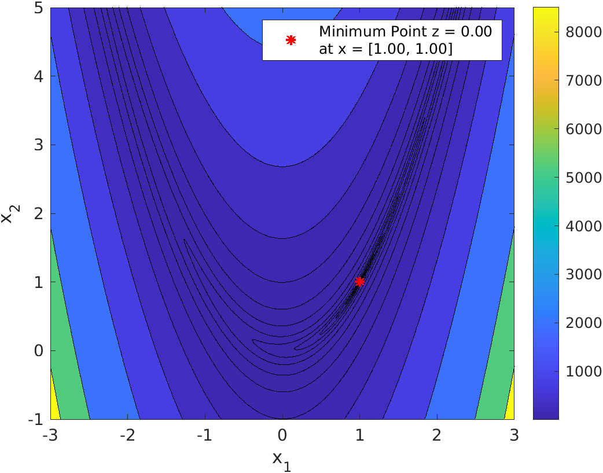

---
title: "ASE387P Optimal Spacecraft Trajectories"
author: [Burton Yale]
date: "2021-10-04"
subject: "ASE387P Optimal Spacecraft Trajectories"
keywords: [ASE387P, UT Austin, Trajectories, Julia]
subtitle: "Homework 3"
lang: "en"
titlepage: false
header-left: "ASE387P"
header-center: "Burton Yale"
header-right: "2021-10-20"
footer-left: "Homework 3"
toc-own-page: true
colorlinks: true
header-includes:
- |
  ```{=latex}
  \usepackage{tcolorbox}

  \newtcolorbox{info-box}{colback=cyan!5!white,arc=0pt,outer arc=0pt,colframe=cyan!60!black}
  \newtcolorbox{warning-box}{colback=orange!5!white,arc=0pt,outer arc=0pt,colframe=orange!80!black}
  \newtcolorbox{error-box}{colback=red!5!white,arc=0pt,outer arc=0pt,colframe=red!75!black}
  ```
pandoc-latex-environment:
  tcolorbox: [box]
  info-box: [info]
  warning-box: [warning]
  error-box: [error]
...

## Problem 1: Root Solving 
::: box
**Problem Statement** Consider the "Rosenbrock" function for $x_1$ and $x_2$:

$$
f(\textbf{x}) = (1-x_1)^2 + 100(x_2-x_1^2)^2
$$
:::

### Part 1.1
::: box
**Problem Statement** Demonstrate the topology of the function for the ranges of $x_1 = [-3 3]$ and $x_2 = [-1 5]$
:::



### Part 1.2
::: box
**Problem Statement** Visually, where is the global minimum?
:::

Looking specifically at the density of the countour lines, indicates a region around $[1 1]$ being the minimum. 

### Part 1.3
::: box
**Problem Statement** Using calculus, demonstrate the answer is a local minimum with the sufficient and necessary conditions.
:::

**Second Order Necessary Condition:** $\nabla f(\textbf{x}_\ast) = \vec{0}$

**Second Order Sufficient Condition:** $\ \nabla^2 f(\textbf{x}_\ast)$ is positive definite

Calculating the first gradient of the function yields a $2\times1$ vector:

$$
\nabla f(\textbf{x}) = \begin{bmatrix}
\frac{\partial f}{\partial x_1} \\
\frac{\partial f}{\partial x_2}
\end{bmatrix} = \left[\begin{array}{c}
2\,x_1 -400\,x_1 \,{\left(x_2 -{x_1 }^2 \right)}-2\\
200\,x_2 -200\,{x_1 }^2
\end{array}\right]
$$
$$
\left[\begin{array}{c}
2\,x_1 -400\,x_1 \,{\left(x_2 -{x_1 }^2 \right)}-2\\
200\,x_2 -200\,{x_1 }^2
\end{array}\right]\bigg\rvert_{\textbf{x}=[1, 1]^T} = \begin{bmatrix}0 \\ 0 \end{bmatrix} {\Large\checkmark}
$$

With the first order gradient having zeros in every index, the second order necessary condition is satisified. Taking the second gradient, using the first, yields a $2\times2$ matrix of second order parital derivatives:

$$
\nabla^2 f(\textbf{x}) = \begin{bmatrix}
\frac{\partial^2 f}{\partial x_1^2} \frac{\partial^2 f}{\partial x_1x_2} \\
\frac{\partial^2 f}{\partial x_2x_1} \frac{\partial^2 f}{\partial x_2^2}
\end{bmatrix} = \left[\begin{array}{cc}
1200\,{x_1 }^2 -400\,x_2 +2 & -400\,x_1 \\
-400\,x_1  & 200
\end{array}\right]
$$
$$
\mathtt{chol(}\left[\begin{array}{cc}
1200\,{x_1 }^2 -400\,x_2 +2 & -400\,x_1 \\
-400\,x_1  & 200
\end{array}\right] \bigg\rvert_{\textbf{x}=[1, 1]^T}\mathtt{)} = \left[\begin{array}{cc}
\sqrt{802} & -\frac{200\,\sqrt{802}}{401}\\
0 & \frac{10\,\sqrt{2}\,\sqrt{401}}{401}
\end{array}\right] {\Large\checkmark}
$$

Seeing as the  Cholesky factorization was completed successfully, the second order gradient evaluated at $[1, 1]^T$ is positive definite, satisfying the second order sufficient condition.