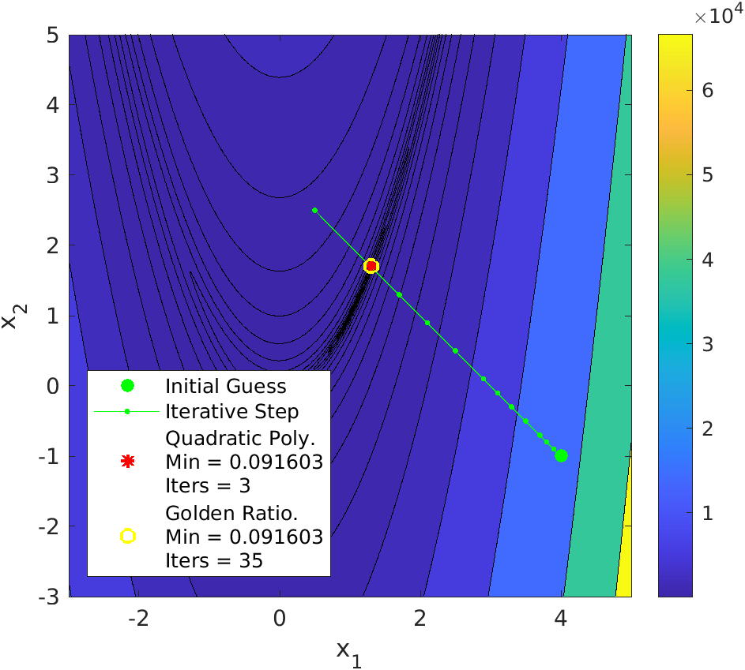
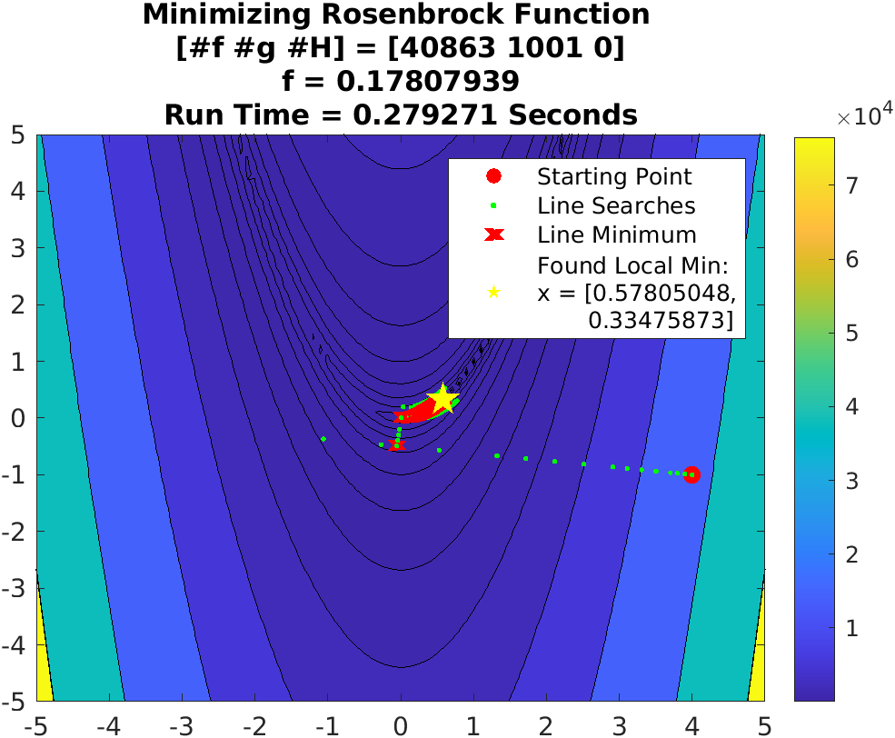
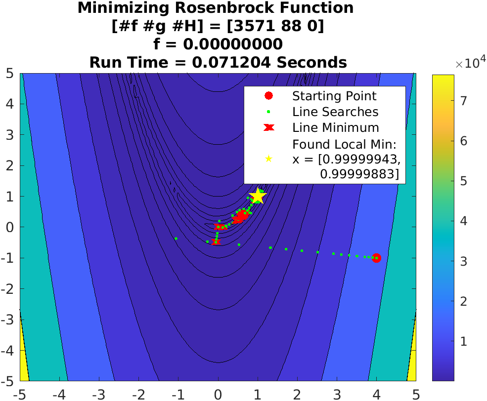
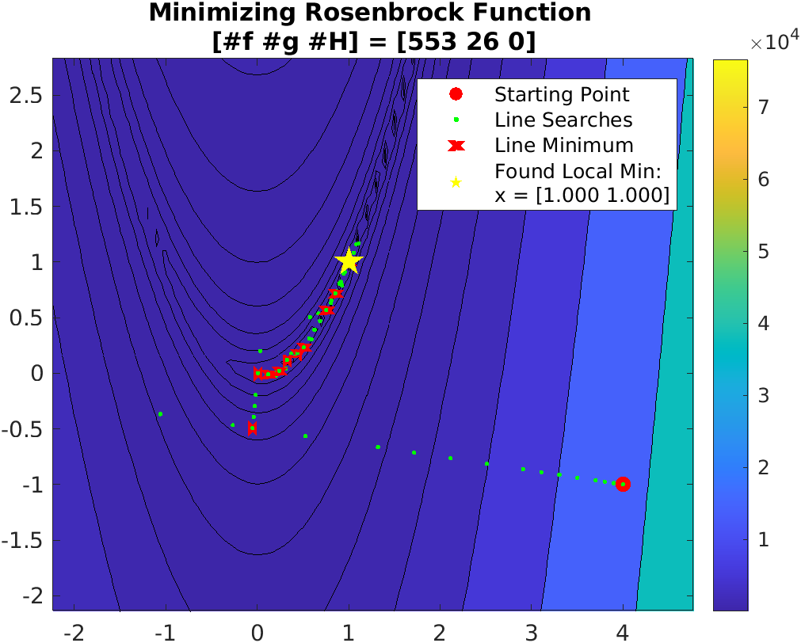
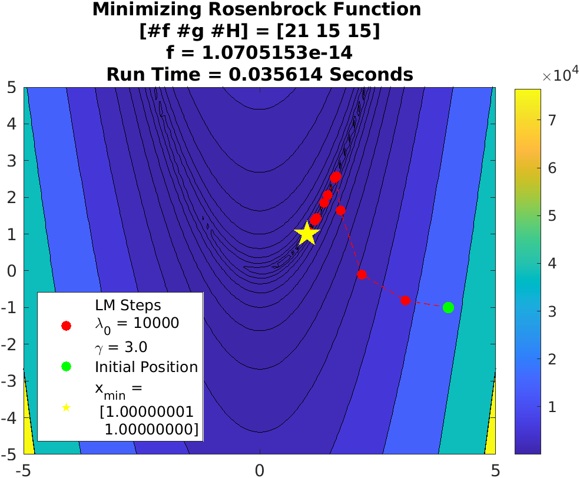

---
title: "ASE387P Optimal Spacecraft Trajectories"
author: [Burton Yale]
date: "2021-10-04"
subject: "ASE387P Optimal Spacecraft Trajectories"
keywords: [ASE387P, UT Austin, Trajectories, Julia]
subtitle: "Homework 3"
lang: "en"
titlepage: false
header-left: "ASE387P"
header-center: "Burton Yale"
header-right: "2021-10-25"
footer-left: "Homework 3"
toc-own-page: true
colorlinks: true
header-includes:
- |
  ```{=latex}
  \usepackage{tcolorbox}

  \newtcolorbox{info-box}{colback=cyan!5!white,arc=0pt,outer arc=0pt,colframe=cyan!60!black}
  \newtcolorbox{warning-box}{colback=orange!5!white,arc=0pt,outer arc=0pt,colframe=orange!80!black}
  \newtcolorbox{error-box}{colback=red!5!white,arc=0pt,outer arc=0pt,colframe=red!75!black}
  ```
pandoc-latex-environment:
  tcolorbox: [box]
  info-box: [info]
  warning-box: [warning]
  error-box: [error]
...

## Problem 1: Root Solving 
::: box
**Problem Statement** Consider the "Rosenbrock" function for $x_1$ and $x_2$:

$$
f(\textbf{x}) = (1-x_1)^2 + 100(x_2-x_1^2)^2
$$
:::

### Part 1.1
::: box
**Problem Statement** Demonstrate the topology of the function for the ranges of $x_1 = [-3,\, 3]$ and $x_2 = [-1,\, 5]$
:::

![Contour map of Rosenbrock function over $x_1 = [-3,\, 3]$ and $x_2 = [-1,\, 5]$](hw3p1a.png)

\newpage
### Part 1.2
::: box
**Problem Statement** Visually, where is the global minimum?
:::

Looking specifically at the density of the countour lines, indicates a region around $[1 1]$ being the minimum. 

### Part 1.3
::: box
**Problem Statement** Using calculus, demonstrate the answer is a local minimum with the sufficient and necessary conditions.
:::

**Second Order Necessary Condition:** $\nabla f(\textbf{x}_\ast) = \vec{0}$

**Second Order Sufficient Condition:** $\ \nabla^2 f(\textbf{x}_\ast)$ is positive definite

Calculating the first gradient of the function yields a $2\times1$ vector:

$$
\nabla f(\textbf{x}) = \begin{bmatrix}
\frac{\partial f}{\partial x_1} \\
\frac{\partial f}{\partial x_2}
\end{bmatrix} = \left[\begin{array}{c}
2\,x_1 -400\,x_1 \,{\left(x_2 -{x_1 }^2 \right)}-2\\
200\,x_2 -200\,{x_1 }^2
\end{array}\right]
$$
$$
\left[\begin{array}{c}
2\,x_1 -400\,x_1 \,{\left(x_2 -{x_1 }^2 \right)}-2\\
200\,x_2 -200\,{x_1 }^2
\end{array}\right]\bigg\rvert_{\textbf{x}=[1, 1]^T} = \begin{bmatrix}0 \\ 0 \end{bmatrix} {\Large\checkmark}
$$

With the first order gradient having zeros in every index, the second order necessary condition is satisified. Taking the second gradient, using the first, yields a $2\times2$ matrix of second order parital derivatives:

$$
\nabla^2 f(\textbf{x}) = \begin{bmatrix}
\frac{\partial^2 f}{\partial x_1^2} \frac{\partial^2 f}{\partial x_1x_2} \\
\frac{\partial^2 f}{\partial x_2x_1} \frac{\partial^2 f}{\partial x_2^2}
\end{bmatrix} = \left[\begin{array}{cc}
1200\,{x_1 }^2 -400\,x_2 +2 & -400\,x_1 \\
-400\,x_1  & 200
\end{array}\right]
$$
$$
\mathtt{chol(}\;\nabla^2 f({[1,\, 1]^T})\;\mathtt{)} = \left[\begin{array}{cc}
\sqrt{802} & -\frac{200\,\sqrt{802}}{401}\\
0 & \frac{10\,\sqrt{2}\,\sqrt{401}}{401}
\end{array}\right] {\Large\checkmark}
$$

Seeing as the  Cholesky factorization was completed successfully, the second order gradient evaluated at $[1, 1]^T$ is positive definite, satisfying the second order sufficient condition.

\newpage

## Problem 2: Single Line Search
::: box
**Problem Statement** Build a general line search subroutine that minimizes an arbitrary n-dimensional function along an arbitrary search direction $\textbf{s}$ starting at an arbitrary location $\textbf{x}$ with an initial stride $t$.
:::

### Part 2.1
::: box
**Problem Statement** Using the Quadratic Polynomial and Golden Ratio Methods, minimize the Rosenbrock function along $\textbf{s} = [-1,\, 1]$ from a starting point $\textbf{x} = [4,\, -1]$ using an initial stride length of $t_0 = 0.1$ and an $\epsilon = 10^{-4}$. Plot the position of each function call and use a different marker for the initial guess and final solution. Report the number of function calls required.
:::



![Slice of Rosenbrock function along $\textbf{s} = [-1,\, 1]$ showing targetted minimum and search points created by Golden Ratio solver.](hw3p2_2.png)

### Part 2.2
::: box
**Problem Statement** Use different strategies for stride adjustment, and discuss the results with regard to the number of function calls required. Present a summary table or plot of your investigation.
:::

When adjusting the stride of the line search, the following method was used. Starting with the initial, given stride length, a certain number of steps were taken, and if the minimum was not bracketed, the stride length would be increased by some multiplication factor. The below table shows the results of varying the number of strides before increasing the step size, per row variance, and how much the stride was increased by, per column variance. Within each cell is the number of iterations to bracket the minimum, find the minimum using the quadratic polynomial method, and find the minimum using the golden ratio method, in that order.

|Number Steps|1.1 Multiplier|1.25 Multiplier|1.5 Multiplier|2.0 Multiplier|2.5 Multiplier|3.0 Multiplier|5.0 Multiplier|
|:------:|:------------:|:-------------:|:------------:|:------------:|:------------:|:------------:|:------------:|
|2       |19,   4,  33    |14,   5,  34     |11,   5,  35    |9,   5,  36     |8,  52,  37     |7,   5,  37     |7,   5,  44     |
|4       |23,   4,  32    |19,   3,  33     |16,   5,  33    |13,   3,  35    |11,   5,  35    |10,   5,  35    |9,   5,  37     |
|8       |26,   4,  32    |23,   4,  32     |21,   4,  33    |18,   3,  34    |17,  3,  34    |16,   4,  33    |13,   3,  34    |
|16      |28,   4,  31    |27,   4,  31     |25,   3,  32    |23,   3,  32    |22,   4,  33    |21,   3,  33    |19,   5,  34    |

One key result from the table is the inverse relationship between the number of iterations to bracket the minimum and find the minimum, with both methods, when varying either the multiplier or number of steps. The faster the minimum is bounded the longer it will take to find the minimum, due to the size of said bracket on the line. One outlier from the results is for the 2 step and 2.5 multiplier result of the quadratic polynomial method. Which hit an iteration limit, and bounced around very near the solution for infinity. 

\newpage

## Problem 3: Adding the Outer Loop
::: box
**Problem Statement** Using the polynomial line search from [Part 2](#part-2.1), build wrapper routines for general n-dimensional unconstrained optimizers using:

1) Seepest Descent
2) Fletcher-Reeves
3) Polak-Ribiere
4) BFGS 

Also build a full second order Levenberg-Marquardt solver with dynamic adjustment of the damping parameter. **Extra Credit:** Build a full trust region solver with dynamic trust region management.
:::

### Part 3.1
::: box
**Problem Statement** For each of the 5 methods, minimize the Rosenbrock function starting at $\textbf{x} = [4,\, -1]$. Plot the $\textbf{x}$ at each major iteration. Tune your codes and try to reduce the number of function calls to a minimum. State success or failure (using a maximum iteration limit of $1000$), the final $\textbf{x}$ and $f$ to 8 digits, and the total number of function calls and derivative function calls (first and second order), also the CPU time required, and machine you are using. Discuss the results and your general strategy. Present a summary table with rows of each method and columns for the characteristics of each method mentioned above.
:::

| Algorithm | $F_{min}$ | Func Calls | Grad Calls | Hess Calls | Run Time (seconds) |
| :---: | --- | --- | --- | --- | --- |
| Steepest Descent | $0.17807939$ | $40863$ | $1001$ | $0$ | $0.279271$ |
| Fletcher Reeves | $1\times10^{-8}$ | $3766$ | $93$ | $0$ | $0.079834$ |
| Polak Ribiere | $0$ | $3571$ | $88$ | $0$ | $0.071204$ |
| BFGS | $0$ | $635$ | $16$ | $0$ | $0.066949$ |
| Levenberg Marquardt | $0$ | $21$ | $15$ | $15$ | $0.031304$ |

{width=65%}

{width=65%}

{width=65%}

{width=65%}



### Part 3.2
::: box
**Problem Statement** Repeat [Part 3.1](#part-3.1) but instead minimize the function below with the two initial conditions: $\textbf{x} = [4,\, -1]$ and $\textbf{x} = [2,\, 3]$.

$$ f = e^{u^2} + \sin(4x_1 - 3x_2)^4 + 0.5(2x_1 + x_2 -10)^2 $$
where
$$u = \frac{1}{2}(x_1^2 + x_2^2 + 25)$$
:::